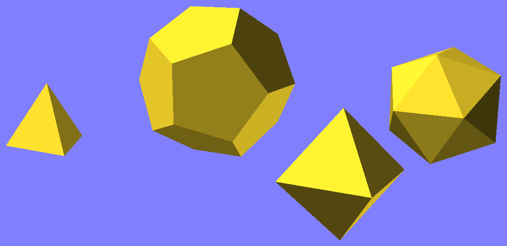

# plato

The non-built-in Platonic solids for OpenSCAD:
* regular tetrahedron (4 faces)
* regular octahedron (8 faces)
* regular dodecahedron (12 faces)
* regular icosahedron (20 faces)

## Screenshot

## References

Wikipedia:
* [Platonic solid](http://en.wikipedia.org/wiki/Platonic_solid)
* [equilateral triangle](http://en.wikipedia.org/wiki/Equilateral_triangle)
* [regular tetrahedron](http://en.wikipedia.org/wiki/Tetrahedron#Regular_tetrahedron)
* [regular octahedron](http://en.wikipedia.org/wiki/Octahedron#Regular_octahedron)
* [regular dodecahedron](http://en.wikipedia.org/wiki/Regular_dodecahedron)
* [regular icosahedron](http://en.wikipedia.org/wiki/Regular_icosahedron)

## Math

*a* denotes the edges of all the solids.

phi:
* *&phiv;* = (1 + &radic;(5)) / 2
* *&phiv;*&sup2; = *&phiv;* + 1

### Regular tetrahedron

* incircle (faces): *r* = &radic;(3) &times; *a* / 6
* circumcircle (faces): *R* = &radic;(3) &times; *a* / 3
* insphere: *r* = &radic;(6) &times; *a* / 12
* circumsphere: *R* = &radic;(6) &times; *a* / 4

### Regular octahedron

* circumsphere: *R* = &radic;(2) &times; *a* / 2

### Regular dodecahedron

If *a* = 2/*&phiv;*, the coordinates of the vertices are:
* (&plusmn;1, &plusmn;1, &plusmn;1)
* circular permutations of (0, &plusmn;*&phiv;*, &plusmn;1/*&phiv;*)

To get coordinates for *a* = 1, multiply them by *&phiv;*/2:
* (&plusmn;*&phiv;*/2, &plusmn;*&phiv;*/2, &plusmn;*&phiv;*/2)
* circular permutations of (0, &plusmn;(*&phiv;*+1)/2, &plusmn;&frac12;)

### Regular icosahedron

Coordinates of vertices if *a* = 1:
* circular permutations of (0, &plusmn;&frac12;, &plusmn;*&phiv;*/2)
